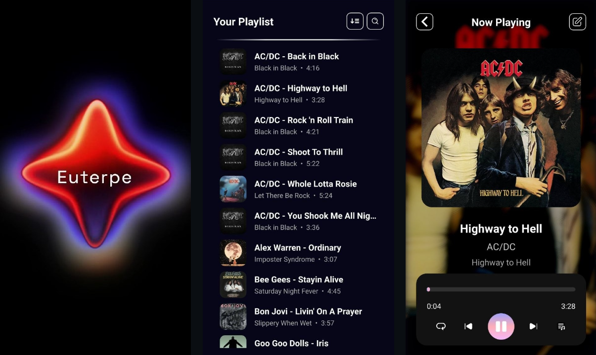
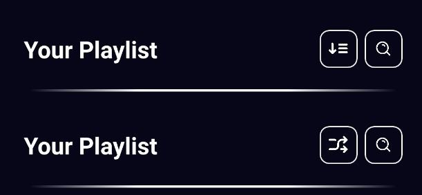
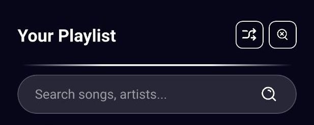
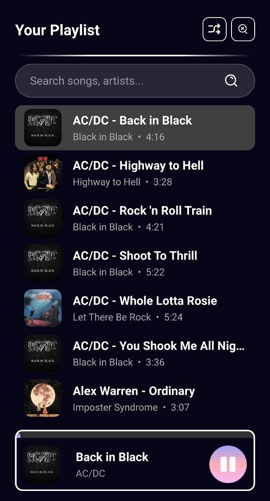
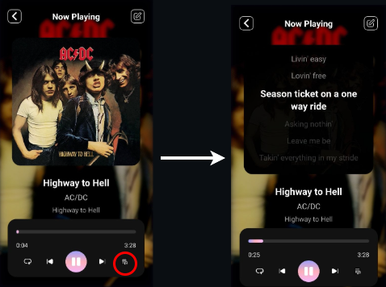
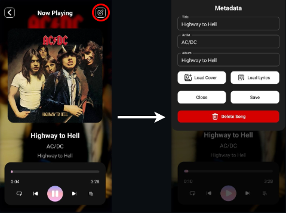

# Euterpe

## 📖 Introduction
<p align="justify">
  
  Euterpe is an Android application that serves the dual purpose of a music player and song manager, developed using C++, Java, Qt6, and QML. This project grew out of a simple necessity: the desire for a music player that is both aesthetically pleasing and easy to use, while being free from tedious, hard-to-close ad banners (we’ve all dealt with those "Close" buttons designed as semi-transparent crosses on multi-colored backgrounds). What started as a basic song list with standard playback controls evolved into a more sophisticated and structured application, eventually becoming a centerpiece of my developer portfolio. I implemented several features including a custom splash screen, a search bar, and a standard metadata editor—covering everything from artist titles to lyrics and cover art. As the functionality expanded, I redesigned the back-end architecture by creating specific entities for dedicated tasks. Being a daily-use mobile app, I focused on intuitive UX/UI choices, such as placing the most frequently used elements at the bottom of the screen for easy reach.
  <br><br>
  A quick note on the name: the application had a different name for most of its development, which eventually felt too generic. I decided to "borrow" a name from Greek mythology. After some research, I chose "Euterpe"—the Muse of music and lyric poetry. It felt intriguing, unique for an app, and perfectly aligned with the project's theme.
  <br><br>
  Finally, any suggestions or improvements are more than welcome. Since this is a personal project, I was only able to test it on three different devices. Given the vast variety of Android versions and screen sizes, community feedback is essential to ensure long-term robustness.
</p>

## Key Features 🚀

- 🎵 **Multi-format Support**: Seamless playback of MP3, M4A, FLAC, and WAV files.
- 🔍 **Instant Search**: Dynamic filtering system by title, artist, or album.
- 📝 **Metadata Editor**: Complete management of audio tags and cover art powered by TagLib.
- 📜 **Lyrics Viewer**: Support for both synchronized and non-synchronized lyrics.
- 🎨 **Modern UX**: "Edge-to-Edge" interface optimized for modern displays with full Safe Area support.
- 🚫 **Ad-Free Experience**: A clean player designed exclusively for listening.

## 🛠️ Technologies
This project integrates multiple languages, each playing a specific role:
- **Java**: Handles critical system-level tasks, including scanning the device via `MediaStore`, writing metadata, and observing the system's media database for real-time list updates.
- **C++ 17 / Qt 6.10.2**: Powers the application's back-end, managing data models, playback logic, and core entity behaviors.
- **QML**: Used to build a fluid and responsive graphical user interface.

The project also utilizes the **TagLib** library. While the app has transitioned toward `MediaStore` and Java for standard operations to align with modern Android standards, TagLib is used to handle complex metadata that the system might miss, such as embedded cover images and specific lyric tags.

## 📱 App Structure
The application uses a stack-based navigation:
- **Splash Screen**: The initial presentation screen where the back-end performs the MediaStore scan to acquire local songs.
- **Main Page**: A comprehensive list of all songs found on the device.
- **Details Page**: A dedicated view for the currently playing track.

<p align="center">
  
</p>

At the top of the Main Page, there are two primary buttons. The first one on the left allows the user to toggle the playback order between sequential and shuffle modes.

<p align="center">
  
</p>

The second button enables the search bar. By typing the name of a song, artist, or album, the list below updates dynamically to show only the filtered results.

<p align="center">
  
</p>

The final element of the main page is the mini player, which appears at the bottom of the screen only when a song is playing.

<p align="center">
  
</p>

The mini player area (excluding the play/pause button) is clickable, allowing the user to switch to the Details Page of the current track. This page features standard playback controls (repeat, previous, play/pause, next) and a toggle button for lyrics, which are displayed over the album cover area. It is worth noting that if the song contains plain text lyrics, they will be displayed as such. However, if a timestamped file is loaded (compatible with portals like Lyricsify), the app will enable synchronized lyrics that follow the song's progress in real-time.

<p align="center">
  
</p>

Lastly, the app includes a comprehensive Metadata Editor. Users can modify the song title, artist name, and album, as well as upload a custom cover image or a new lyrics file. Upon clicking the "Save" button, a banner will appear to confirm whether the changes were successfully applied.

<p align="center">
  
</p>

## ⚙️ Build & Installation

To build and run Euterpe on your device or emulator, you must properly configure the Qt for Android development environment.
The prerequisites are:
- **Qt Creator** (v13.0 or higher recommended).
- **Qt 6.10.2** (or compatible 6.x versions) with the Android module.
- **Android SDK & NDK**: Correctly configured within Qt Creator.
- **TagLib**: Already included in the project (must be linked via `.pro` or `CMakeLists.txt`).
<br><br>

The steps for compiling the project are:
1. **Clone the repository**:
   ```bash
   git clone [https://github.com/AndreaMazzera/Euterpe.git](https://github.com/AndreaMazzera/Euterpe.git)
   cd euterpe
   ```
2. **Open the project**: Load the CMakeLists.txt (or .pro) file into Qt Creator.
3. **Kit configuration**: Select the Android Qt 6.10.2 Clang kit (e.g. arm64-v8a).
4. **Run**: Connect a device with USB Debugging enabled and press Ctrl + R.

Notes on signing: To generate a production APK, change the configuration to Release and configure your Keystore in Projects > Android Build Settings.

